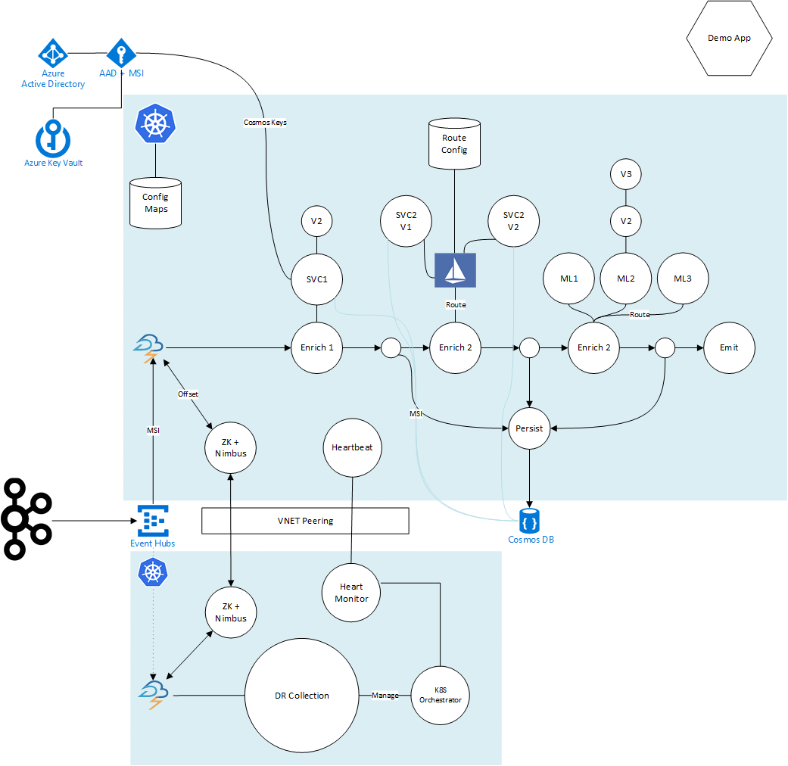

# Ravenswood

Jordan Knight, Lace Lofranco, Vaughan Knight, Regan Murphy, Rian Finnegan, et. al.
June 2018

Thanks to [Matthew Farrellee](https://github.com/mattf) <matt@cs.wisc.edu> for inspiration and for getting us started with the Dockerisation steps.  

Thanks to [Kenneth Ownes](https://github.com/kow3ns/kubernetes-zookeeper) for solving so much of the ZooKeeper stuff which was a great starting place. 
<!-- TOC -->

- [Ravenswood](#ravenswood)
    - [Work in Progress](#work-in-progress)
    - [How](#how)
    - [Overview](#overview)
        - [Stream Processing](#stream-processing)
        - [Funamental Principals](#funamental-principals)
            - [Immutable and Well Versioned Deployments](#immutable-and-well-versioned-deployments)
        - [Core Tenets](#core-tenets)
        - [What is Actually Deployed?](#what-is-actually-deployed)
        - [Intelligent Routing](#intelligent-routing)
        - [Other Technologies](#other-technologies)
        - [Managed Kubernetes](#managed-kubernetes)
        - [Cosmos DB](#cosmos-db)
        - [Existing Code](#existing-code)
    - [Main System Components](#main-system-components)
    - [Technical Features](#technical-features)
    - [Design Features](#design-features)
        - [The Kubernetes (K8S) Cluster is development environment](#the-kubernetes-k8s-cluster-is-development-environment)
        - [Highly available cluster nodes](#highly-available-cluster-nodes)
        - [Immutable deployments](#immutable-deployments)
        - [Multi-region deployments](#multi-region-deployments)
        - [Multi-Regional reading](#multi-regional-reading)
        - [Automatic Failover to another geo-redundant region](#automatic-failover-to-another-geo-redundant-region)
        - [Service mesh](#service-mesh)
        - [DevOps Based Approach](#devops-based-approach)
    - [Experimentation Enablement](#experimentation-enablement)
        - [The power of the orchestrator](#the-power-of-the-orchestrator)
        - [Simple, repeatable deployments](#simple-repeatable-deployments)
        - [Stand up a second experimentation pipeline beside the production system](#stand-up-a-second-experimentation-pipeline-beside-the-production-system)
        - [Event Hubs can be leveraged to emit the same stream twice](#event-hubs-can-be-leveraged-to-emit-the-same-stream-twice)
        - [Azure Cosmos DB can write to a second +more database in real time](#azure-cosmos-db-can-write-to-a-second-more-database-in-real-time)
        - [Faster engineering iteration](#faster-engineering-iteration)
        - [Experimentation pipe can be used as test bed](#experimentation-pipe-can-be-used-as-test-bed)
        - [Spark can use the second pipe and database](#spark-can-use-the-second-pipe-and-database)
    - [Security Considerations](#security-considerations)
        - [Managed Service Identities](#managed-service-identities)
        - [Azure KeyVault](#azure-keyvault)
        - [Cluster lock down](#cluster-lock-down)
        - [Cluster Sentinel](#cluster-sentinel)
        - [Service Identity Verification](#service-identity-verification)

<!-- /TOC -->

## Work in Progress
This repo is in progress. Documentation on the *how* is underway. Right now it's just code samples and this document.

## How

Jump straight to the juicy bits - the code. 

- [Getting Started](docs/getting_started.md)
- [Building the Clusters](docs/cluster_build.md)
- [Deploying the Bits](docs/deploying_the_bits.md)
- [Sending Test Events](docs/sending_test_events.md)
- [Building the Containers](docs/docker.md)
- [Editing the Topology](docs/editing_topology.md)
- [Testing the Intelligent Routing](docs/intelligent_routing.md)
- [Testing the Fail Over](docs/fail_over.md)
- [Components of the System](docs/system_components.md)

## Overview
The Ravenswood Reference Architecture is a modern description and sample detailing how to build a highly available, high performance near-realtime stream processing pipeline.  

It is designed and maintained by a group of Microsoft Engineers from the ground up with cloud first and engineering principles in mind. 

The guide includes code, documentation and samples on how to build and deploy such a system. Please note: This document is not the full guide, it is an overview for dissemination purposes. 

### Stream Processing

A stream processing system takes a small piece of data and runs it through a pipeline to add and enrich the data from various sources. These sources could be databases or machine learning scoring systems. This data is then saved re-emitted to another stream (Kafka or Event Hubs) and/or saved to a database. All this happens very quickly - sometimes in the order of milliseconds - meaning near real-time enrichment of data streams. This is opposed to processing later with batch processing or processing using database capabilities such as joins etc (which is very expensive and doesn't scale as well).

Each stream processing step (which in Apache Storm are called "bolts") will in some way modify and re-emit te data. One way to do this is to call a service to mutate the data. In this system the services are deployed along side the pipeline in Kubernetes. 

An alternate method would be batch processing whereby data is enriched in place later (maybe soon after) it is written. Often streaming is used with batch processing such as in the [lambda architecture](https://en.wikipedia.org/wiki/Lambda_architecture). 

This document is based on Apache Storm, but can easily be adapted to use [Spark Structured Streaming](https://spark.apache.org/docs/latest/structured-streaming-programming-guide.html) or other similar technologies. 

### Funamental Principals

#### Immutable and Well Versioned Deployments

An immutable deployment, as the name suggests, is a deployment that cannot be changed after it has been deployed. This principal is applied in our other projects including our [ML training and scoring DevOps pipeline](https://github.com/jakkaj/ml-train-deploy-vsts-k8s).  

The principal drives some good system design principals:

- Good versioning strategy
- Separated deployments. Deploy the same code side by side in a different deployment
- Blue/Green Deployments as you cannot replace a deployment
- Separation of concerns including code versioning, routing and security
- Providence of all deployments including code, settings, cluster configuration and more
- End-to-end no humans directly affecting the software

### Core Tenets

The following requirements and tenets for the basis for the design of the system.
Tenets and requirements

- Stateful systems use managed services. 
    - Data has gravity and needs special consideration in a cloud environment – data is hosted in Cosmos DB
- Stateless software deployments use Kubernetes (K8S) for ultimate developer power, system flexibility and control
- Designed from the group up around current engineering best practise
- Always on architecture 
- Blue/Green deployments
- Immutable
    - Environment state is known and trusted at all times
    - Deployments are never modified
    - New versions are an entirely new deployment which is switched on via the blue/green mechanism or similar methods
- High Resilience
    - Highly available
    - Disaster recoverable
    - Self-healing
    - Geo-redundant, fast fail over
- Flexible Experimentation
    - Ability to change, replace, modify, experiment
    - Test, developer deployments on production data without interfering with production
    - Suited to machine learning model training and hyperparameter tuning on real data

- Developer First
    - High velocity software delivery and experimentation

The result is a simple, elegant system based on the powerful feature sets available in Kubernetes and Cosmos DB.

The system is two or more Kubernetes clusters split across geo-separate regions in to which the Apache Storm clusters (or equivalent workload), services and other software is deployed. The Storm cluster is deployed as one single unit including Zoo Keeper, Nimbus and Supervisor nodes. When an updated version needs to be deployed, the entire cluster can be re-deployed as a single unit or individual components can be deployed and then migrated to using techniques including intelligent routing. For example, a new version of a service that helps enrich the Storm event stream can be deployed and switched over to at runtime once it has been tested – without any downtime what-so-ever.   

The core principal here is that once things are deployed they are not modified – they are never updated. They are only even deleted. A new version will be deployed alongside the old version then the system will switch over to the new version, with the old version being cleaned up at some time in the future. This helps manage deployment complexity and manage cluster state. With the power of the K8S orchestrator, it only makes sense to rely on it to enable these desirable scenarios. 

### What is Actually Deployed?

This system by default will deploy:

- Configurable amount of ZooKeeper services in a [StatefulSet](https://kubernetes.io/docs/concepts/workloads/controllers/statefulset/) complete with [anti-pod affinity](https://kubernetes.io/docs/concepts/configuration/assign-pod-node/#affinity-and-anti-affinity) and update strategies
- Configurable amount of Nimubs nodes with the same StatefulSets, anti-pod affinity and update strategies
- Configurable amount of Storm Supervisor nodes
- Apache Storm UI
- Three sample services each with two versions for intelligent routing demonstrations
- Storage Configuration
- Secrets and Configuration
- A heart beat generating services
- A sample storm topology
- Some starting Istio routes

### Intelligent Routing

A system such as [Istio](https://istio.io/docs/setup/kubernetes/quick-start/) can route to these services intelligently. It can route based on a cluster wide setting (meaning you can change which service is called at runtime), or it can route based in data that was added by previous steps. Importantly the actual processing step (the Bolt) is not aware of the intelligent routing - it does not need to know which actual service is being called - decoupling the complexity of versioning and routing away from the process step. 

### Other Technologies

This same approach can work with other technologies such as [Spark Streaming](https://spark.apache.org/streaming/) or [Kafka Streams](https://kafka.apache.org/documentation/streams/). Indeed it could work with non-streaming related systems include web endpoints etc. 

The same tech and approaches (scripts, Helm, Istio, Kubernetes etc.) could even be applied when Apache Storm is entirely removed from the equation - instead perhaps opting for PaaS based Spark Streaming in [Azure HDInsight](https://docs.microsoft.com/en-us/azure/hdinsight/spark/apache-spark-streaming-overview) or even something as cool as [Databricks](https://azure.microsoft.com/en-au/services/databricks/). 

In this regard, this repo can be used for ideas, nuggets and suggestions on how to go about building a scalable and adaptable - and above all DevOps focused stream processing platform. A scalable and HA/DR Zookeeper + Nimubs + Storm Supervisor system is complex and this example solves this well - it can most certainly be used as a starting point for other similar systems.  

### Managed Kubernetes
The Kubernetes clusters themselves are created with a managed service called the Azure Kubernetes Service or AKS. AKS is a system which creates and manages a vanilla version of Kubernetes for the customer – underlying VMs are automatically patched by Azure and system maintenance is automated. The customer only needs to worry about their own software running within the cluster inside the Docker containers. 

AKS also comes packed with the usual security features that you’d expect from an Azure service. From the AKS documentation: Control access to your Kubernetes cluster with Azure Active Directory accounts and user groups. For fine-grained control over Kubernetes resources, integrate Azure Active Directory with Kubernetes role-based access controls. Safeguard cryptographic keys and other secrets used by Kubernetes master and agent nodes with Key Vault. Secure your container network communication with custom virtual networks, Azure Container Network Interface (CNI) and network policy enforcement.

### Cosmos DB
This architecture is enabled by features within Azure Cosmos DB. Cosmos is a globally available hyperscale managed database platform. It can replicate data to any of the 42 regions worldwide – including up to four in Australia. This feature is utilised by the Ravenswood architecture during a fail over event. If a region fails entirely, the system will fail over to the next region. Because Cosmos has been actively replicating in to other regions, the data ready to go without any extra work required on the customer’s behalf – meaning the system can fall to the fail over state extremely quickly.

Cosmos DB supports the [Cassandra API](https://docs.microsoft.com/en-us/azure/cosmos-db/cassandra-introduction) for ease of upgrade from an existing Cassandra deployment. 

### Existing Code
The new system should largely work without heavy modification of existing code should it exist. Some parts that may need to change are around the way services are configured depending on how the current code is set up. 

## Main System Components

The system feeds events emitted by any system - including potentially Apache Kafka which are sent to an [Azure Event Hub](https://docs.microsoft.com/en-us/azure/event-hubs/event-hubs-about). This Event Hub can be subscribe to multiple times by various services including production and experimentatal versions without having to bring data up the express route pipe twice. It is also geo-redundant and can keep data in multiple regions in case of disaster. 

This Event Hub is referenced by an Apache Storm spout that forms part of a Storm topology deployed in to a Kubernetes cluster ([AKS](https://azure.microsoft.com/en-au/services/kubernetes-service/)) in Sydney. Along the way Storm Bolts enrich the data gathered from numerous services external to the storm topology. 

The Storm topology emits the enriched data to [Azure Cosmos DB](https://azure.microsoft.com/en-au/services/cosmos-db/).

A second cluster is alive and running in Melbourne. Deployments are automatically sent to both clusters. The Melbourne cluster may however choose to keep some components dormant until a fail over is signalled by a heat monitoring system. In such scenarios, the Storm topology will fire up (within seconds) and start pulling messages from the Event Hub. The second cluster will read and write to a local region Cosmos DB as it is mutli-regional.  

Keys and secrets are managed by a mixture [Azure KeyVault](https://azure.microsoft.com/en-gb/services/key-vault/), [Managed Service Identities](https://docs.microsoft.com/en-us/azure/active-directory/managed-service-identity/overview) and services are secured where possible using [Service Endpoints](https://docs.microsoft.com/en-us/azure/virtual-network/virtual-network-service-endpoints-overview). 

The rest of the document describes the design goals and features of the system. 

## Technical Features

This system uses [Istio](https://istio.io/docs/concepts/what-is-istio/overview/) for intelligent routing, [Helm](https://helm.sh/) for flexiable and dynamic deployments, [StatefulSets](https://kubernetes.io/docs/concepts/workloads/controllers/statefulset/) for managing always on services (Zookeeper and Nimbus for exmaple) +much more. 

## Design Features
### The Kubernetes (K8S) Cluster is development environment

One of the most powerful design features of K8S is its ability to separate out and abstract away concerns from the applications that are running in the cluster. Once problems and requirements are solved for the cluster all software deployed enjoys the benefits of those solutions. 

In this regard deployed software is decoupled from the environment, it does not need to know a range of concepts that are taken care of by the cluster such as security, intelligent routing, access control, configuration management and more. 

Furthermore, the K8S cluster can be locked down thus abstracting main code and deployment security aspects away from code running in the cluster. Clusters can be restricted, "[admission controllers](https://kubernetes.io/docs/reference/access-authn-authz/admission-controllers/)" can ensure only allowed containers and configs are ever applied to the cluster and container registries can be locked down, so the cluster will only pull from trusted sources. Code and containers can be signed and verified, and services running in the cluster can have their identities verified by certificates.

### Highly available cluster nodes

Azure has a feature called [availability sets](https://docs.microsoft.com/en-us/azure/virtual-machines/windows/manage-availability) which help across a range of HA concepts including server updates as well as unplanned downtime. Servers in different availability sets are spaced across different network, power and physical server racks to separate their physical infrastructure.  Nodes in AKS clusters are automatically created in across two availability sets. 

### Immutable deployments 

Deployments must be versioned and immutable. No deployment is ever over-written. This helps simplify cluster complexity as well as ensure deployments can be re-created later, and are fully traceable. It also ensures that pipelines and code can be stood up side-by-side without interfering with each other (for examples, experimental version of Storm pipes, including associated services). 

### Multi-region deployments

A single deployment can be sent to many regions at the same time. A backup region can be kept in sync, but dormant until the primary region fails. 

### Multi-Regional reading

Cosmos can be always read in any of the regions that it is replicated to – meaning that services hosted in Melbourne can read data stored in Melbourne, services hosted in Sydney read data stored in Sydney.  

### Automatic Failover to another geo-redundant region

A heart beat service will keep track of a live signal coming from the remote cluster and cause a fail over event automatically should the heartbeat flatline. 

### Service mesh

The system relies on the concept of a service mesh – a collection of services. As the collection of services grows in size and deployment complexity it can be harder and harder to manage. This system uses Istio coupled with the deployment versioning and immutability talked about earlier in the document to provide an elegant software delivery system. 

Each component of the system is versioned using a specified convention. Newer versions are deployed alongside older versions. When ready the service mesh routing configuration will be updated to route traffic to the new service. This routing can also support intelligent routing – some users go to service version 1 and other users go to service version 2 etc. 

The routing system can also provide % based splits for service draining, merging and A/B testing.

The service mesh can take care of inter service communication security and identity as well as securing down cluster egress capability. 

### DevOps Based Approach

The system is built from the group up using a DevOps first approach. All components can be deployed multiple times as long as they have a different version. This means multiple full end-to-end stream processing pipelines can be deployed and maintained simultaneously. This could be production, test and experimentation systems, all pulling form live data sources. 

The intelligent routing service mesh enables new software to be deployed using blue/green techniques, or to roll forward and back or to re-deploy an old version from years ago for validation purposes. 

The containerised nature of the platform means that a developer can fire up the full pipe and services on their own local machine. 

The system can be deployed using CI and CD techniques – the latest version of the Storm cluster and associated services can always be deployed automatically in a test cluster straight after checking (or pull request!).

Once the test cluster is configured by CI/CD processes, it can have a host of automated tests fired at it as part of the DevOps automation process.

Builds are automatic, and all code is build and deployed in contains to a secure (and geo-replicated) container registry. This registry will hold containers forever. This means that at any point in the future a container can be pulled an interrogated. 

Systems can be set up to keep track of the container state after each change. This means you have a running log of the full cluster state, config, deployed containers, versions, where they came from (which build-id and who checked in the last change!) plus much more to help with provenance and data lineage. You can track back to the people, pull requests, tests, tasks (Jira perhaps) that went in to making the cluster that state on that day. 

You can always re-create that cluster state from any time in the past simply by re-applying the desired cluster configuration – which will set up the cluster services and pull the correct version of the container images. 

## Experimentation Enablement
The following axioms build from one another to culminate in an extremely flexible and capable experimentation. 

### The power of the orchestrator
The K8S based system is very flexible, it is easy to deploy new versions of software in to the cluster.  

### Simple, repeatable deployments

This system is designed to be managed via pure DevOps processes from end-to-end. The environment can be simply re-created as an exact copy, or with minor modifications – such as input and output.

### Stand up a second experimentation pipeline beside the production system 

The system can be re-deployed as a “test version” that sits side by side the production system. 

### Event Hubs can be leveraged to emit the same stream twice

Once the stream of data is taken up in to Azure Event Hubs, the data can be accessed by many different consumer groups, meaning a test system can access the stream independently from the production system without placing extra load on the original event emitting systems. 

### Azure Cosmos DB can write to a second +more database in real time
Using a method called the “change feed”, a Cosmos DB can be configured to write to a second Cosmos database in real-time. See [https://docs.microsoft.com/en-us/azure/cosmos-db/lambda-architecture](https://docs.microsoft.com/en-us/azure/cosmos-db/lambda-architecture) and [https://docs.microsoft.com/en-us/azure/cosmos-db/change-feed](https://docs.microsoft.com/en-us/azure/cosmos-db/change-feed). 
- Change feed enables Lambda Architecture scenarios for experimentation
- Second database can be used as a read only system with a different configuration
- N database can be added in the future as the change feed can be back read from collection creation 

### Faster engineering iteration
One of the most important aspects to developer experience is the code-> run -> result loop. The shorter the time between modify code and gathering data, the faster the developer can iterate their code. This test system allow an engineer to run experiments on the test pipe using real data without having to modify the production pipeline. 

### Experimentation pipe can be used as test bed
The concepts that are used to create the experimentation pipe can be used to create staging/testing environments which can be tested using real data before new components are promoted to production. 

### Spark can use the second pipe and database
Regardless of how the data gets in to a second non-production database (change feed or replica storm pipe) a Spark environment can be set up either in the K8S cluster or by using the PaaS HDInsight Spark service. This can then be used to further experiment on data without needing to modify the production data set. See [https://docs.microsoft.com/en-us/azure/hdinsight/spark/apache-spark-overview](https://docs.microsoft.com/en-us/azure/hdinsight/spark/apache-spark-overview) for more information. 

## Security Considerations
### Managed Service Identities
[Managed Service Identities](https://docs.microsoft.com/en-us/azure/active-directory/managed-service-identity/overview) are a system backed by Azure Active Directory that assigns an identity to services, including those running within AKS. This identity can then be given permission to Azure Services such as Azure KeyVault. This provides a neat and abstracted way to “seed” the first step in the security chain – something somewhere needs to initiate access and have keys to the system. No credentials are needed in code or in app configuration. 

### Azure KeyVault
[Azure KeyVault](https://docs.microsoft.com/en-gb/azure/key-vault/key-vault-overview) is an option for safeguarding and managing / cycling keys outside of the software’s deployment. It can manage and cycle certificates and is backed by HSMs. 

### Cluster lock down 
The cluster can be configured to interrogate all changes before they are applied. This is configurable by the cluster administrator. Containers can be checked, configurations validated or rejected and signatures validated before they are allowed admission to the cluster.   

### Cluster Sentinel
A custom service can scan the cluster to ensure its actual state complies with expected state. This includes deployed configurations, routes, containers etc.

### Service Identity Verification
Clusters can be configured to automatically modify deployments to add features to pods in a pattern called a sidecar. These containers can perform extra tasks such as validate that other services in the cluster are who they say they are and also encrypt traffic automatically between containers. Istio is one such open source product that implements this and is utilised as part of this design. 
